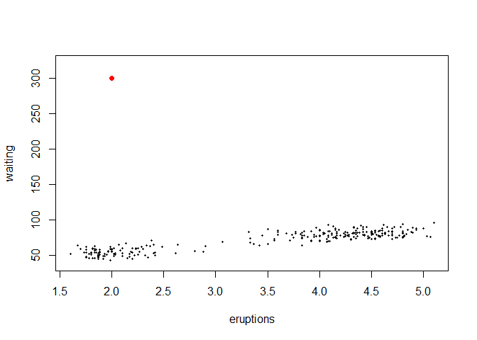
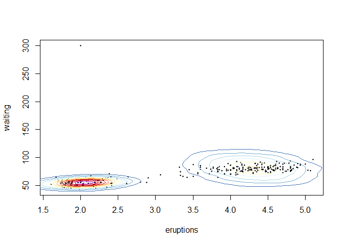
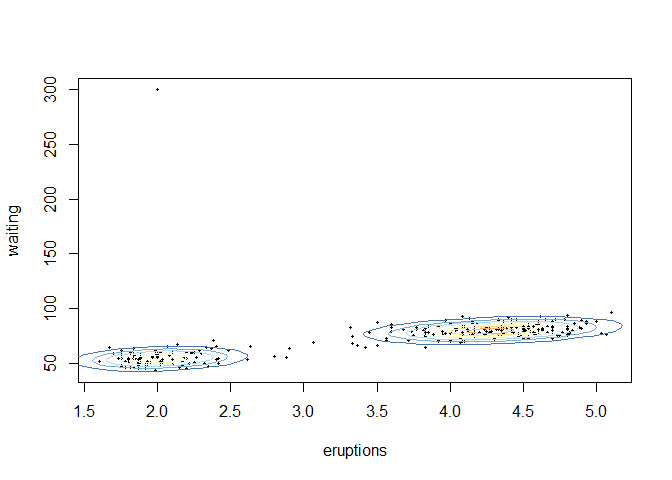

t Mixture Model
================

Model
-----

Say we have a set of  dimensional observations . A t Mixture Model (tMM) is a parametric probabilistic model that assumes each observation, , is generated from a finite mixture of multivariate t distributions. Unlike Gaussian Mixture models (GMMs), tMMs are robust to outliers, and as such can be used as a robust method of clustering. This robustness, however, comes at a computational expense.

A random vector  of dimension  is said to follow a multivariate t distribution, "), if the probability density function of  is:

![f\_{\\boldsymbol{T}}(\\boldsymbol{x}| \\boldsymbol{\\mu}, \\boldsymbol{\\Sigma}, \\nu) = \\frac{\\Gamma\[(\\nu + p)/2\]}{\\Gamma(\\nu/2)\\nu^{p/2}\\pi^{p/2} |\\boldsymbol{\\Sigma}|^{\\frac{1}{2}}}  \\left\[1 + \\frac{1}{\\nu}(\\boldsymbol{x} - \\boldsymbol{\\mu})^T \\boldsymbol {\\Sigma^{-1}}(\\boldsymbol{x} - \\boldsymbol{\\mu}) \\right\]^{-(\\nu+p)/2}](https://latex.codecogs.com/png.latex?f_%7B%5Cboldsymbol%7BT%7D%7D%28%5Cboldsymbol%7Bx%7D%7C%20%5Cboldsymbol%7B%5Cmu%7D%2C%20%5Cboldsymbol%7B%5CSigma%7D%2C%20%5Cnu%29%20%3D%20%5Cfrac%7B%5CGamma%5B%28%5Cnu%20%2B%20p%29%2F2%5D%7D%7B%5CGamma%28%5Cnu%2F2%29%5Cnu%5E%7Bp%2F2%7D%5Cpi%5E%7Bp%2F2%7D%20%7C%5Cboldsymbol%7B%5CSigma%7D%7C%5E%7B%5Cfrac%7B1%7D%7B2%7D%7D%7D%20%20%5Cleft%5B1%20%2B%20%5Cfrac%7B1%7D%7B%5Cnu%7D%28%5Cboldsymbol%7Bx%7D%20-%20%5Cboldsymbol%7B%5Cmu%7D%29%5ET%20%5Cboldsymbol%20%7B%5CSigma%5E%7B-1%7D%7D%28%5Cboldsymbol%7Bx%7D%20-%20%5Cboldsymbol%7B%5Cmu%7D%29%20%5Cright%5D%5E%7B-%28%5Cnu%2Bp%29%2F2%7D "f_{\boldsymbol{T}}(\boldsymbol{x}| \boldsymbol{\mu}, \boldsymbol{\Sigma}, \nu) = \frac{\Gamma[(\nu + p)/2]}{\Gamma(\nu/2)\nu^{p/2}\pi^{p/2} |\boldsymbol{\Sigma}|^{\frac{1}{2}}}  \left[1 + \frac{1}{\nu}(\boldsymbol{x} - \boldsymbol{\mu})^T \boldsymbol {\Sigma^{-1}}(\boldsymbol{x} - \boldsymbol{\mu}) \right]^{-(\nu+p)/2}")

Where  is a  location vector,  is a  positive definite scale matrix and , the degrees of freedom, is a natural number.

A random vector  is said to be  component finite mixture of multivariate  distributions if the probability density function of  is given by:

 = \sum_{g=1}^G \pi_g f_{\boldsymbol{T_g}}(\boldsymbol{x} | \boldsymbol{\mu_g}, \boldsymbol{\Sigma_g}, \nu_g ) 
")

where

, \quad \sum_{g=1}^G \pi_g = 1, \quad 0 \leq \pi_g \leq 1, \forall g
")

Parameter Estimation
--------------------

The parameters of the model are  for  (, the number of components, is assumed to be known) and are estimated using maximum likelihood. However, the likelihood function is difficult to maximize using standard methods and so a special case of the minorize-maximize algorithm, the Expectation Maximization (EM) algorithm, is used. The EM algorithm is an iterative algorithm in which the parameters of the model are updated at each iteration (divided into an E-step and then an M-step) until a specified stopping criterion. Like many iterative algorithms the EM algorithm requires a starting estimate for the parameters. One of the advantages of the EM algorithm is that the parameter estimates at each iteration of the algorithm are guaranteed to yield a greater log likelihood than the parameter estimates of the previous iteration, a consequence of Jensen's Inequality. The parameter estimates at each iteration are as follows:

**E step**

The values computed in the E-step are to compute the parameter estimates in the M-step.

![
E\[Z\_{ig}|\\boldsymbol {X\_i}\] =  \\frac{\\pi\_g f\_{\\boldsymbol {T\_g}}(\\boldsymbol {X\_i})}{\\sum\_{g=1}^G \\pi\_g f\_{\\boldsymbol {T\_g}}(\\boldsymbol {X\_i})}
](https://latex.codecogs.com/png.latex?%0AE%5BZ_%7Big%7D%7C%5Cboldsymbol%20%7BX_i%7D%5D%20%3D%20%20%5Cfrac%7B%5Cpi_g%20f_%7B%5Cboldsymbol%20%7BT_g%7D%7D%28%5Cboldsymbol%20%7BX_i%7D%29%7D%7B%5Csum_%7Bg%3D1%7D%5EG%20%5Cpi_g%20f_%7B%5Cboldsymbol%20%7BT_g%7D%7D%28%5Cboldsymbol%20%7BX_i%7D%29%7D%0A "
E[Z_{ig}|\boldsymbol {X_i}] =  \frac{\pi_g f_{\boldsymbol {T_g}}(\boldsymbol {X_i})}{\sum_{g=1}^G \pi_g f_{\boldsymbol {T_g}}(\boldsymbol {X_i})}
")

![
E \\left\[U\_i| \\boldsymbol{X\_i}, \\boldsymbol{Z\_i}  \\right\] = \\frac{v\_{k\_i} + p}{ \\nu\_{k\_i} + (\\boldsymbol{X\_i} - \\boldsymbol{\\mu\_{k\_i}})^T \\boldsymbol{\\Sigma\_g}^{-1}(\\boldsymbol{X\_i} - \\boldsymbol{\\mu\_{k\_i}})}
](https://latex.codecogs.com/png.latex?%0AE%20%5Cleft%5BU_i%7C%20%5Cboldsymbol%7BX_i%7D%2C%20%5Cboldsymbol%7BZ_i%7D%20%20%5Cright%5D%20%3D%20%5Cfrac%7Bv_%7Bk_i%7D%20%2B%20p%7D%7B%20%5Cnu_%7Bk_i%7D%20%2B%20%28%5Cboldsymbol%7BX_i%7D%20-%20%5Cboldsymbol%7B%5Cmu_%7Bk_i%7D%7D%29%5ET%20%5Cboldsymbol%7B%5CSigma_g%7D%5E%7B-1%7D%28%5Cboldsymbol%7BX_i%7D%20-%20%5Cboldsymbol%7B%5Cmu_%7Bk_i%7D%7D%29%7D%0A "
E \left[U_i| \boldsymbol{X_i}, \boldsymbol{Z_i}  \right] = \frac{v_{k_i} + p}{ \nu_{k_i} + (\boldsymbol{X_i} - \boldsymbol{\mu_{k_i}})^T \boldsymbol{\Sigma_g}^{-1}(\boldsymbol{X_i} - \boldsymbol{\mu_{k_i}})}
")

![
E \\left \[\\log(U\_i)| \\boldsymbol { X\_i}, \\boldsymbol {Z\_i } \\right\]  = \\psi \\left\[\\frac{1}{2}(\\nu\_{k\_i} + p) \\right\] + \\log \\left\[E \[U\_i| \\boldsymbol  {X\_i}, \\boldsymbol {Z\_i}\] \\right\] - \\log\\left(\\frac{1}{2}(v\_{k\_i} + p)\\right)
](https://latex.codecogs.com/png.latex?%0AE%20%5Cleft%20%5B%5Clog%28U_i%29%7C%20%5Cboldsymbol%20%7B%20X_i%7D%2C%20%5Cboldsymbol%20%7BZ_i%20%7D%20%5Cright%5D%20%20%3D%20%5Cpsi%20%5Cleft%5B%5Cfrac%7B1%7D%7B2%7D%28%5Cnu_%7Bk_i%7D%20%2B%20p%29%20%5Cright%5D%20%2B%20%5Clog%20%5Cleft%5BE%20%5BU_i%7C%20%5Cboldsymbol%20%20%7BX_i%7D%2C%20%5Cboldsymbol%20%7BZ_i%7D%5D%20%5Cright%5D%20-%20%5Clog%5Cleft%28%5Cfrac%7B1%7D%7B2%7D%28v_%7Bk_i%7D%20%2B%20p%29%5Cright%29%0A "
E \left [\log(U_i)| \boldsymbol { X_i}, \boldsymbol {Z_i } \right]  = \psi \left[\frac{1}{2}(\nu_{k_i} + p) \right] + \log \left[E [U_i| \boldsymbol  {X_i}, \boldsymbol {Z_i}] \right] - \log\left(\frac{1}{2}(v_{k_i} + p)\right)
")

") denotes the digamma function.

**M step**

![
\\hat \\pi\_g = \\frac{\\sum\_{i=1}^n E\[Z\_{ig}|\\boldsymbol {X\_i}\] }{n} = \\text{Ave}\_{i=1, \\dots, n}(E\[Z\_{ig}|\\boldsymbol{X\_i}\])
](https://latex.codecogs.com/png.latex?%0A%5Chat%20%5Cpi_g%20%3D%20%5Cfrac%7B%5Csum_%7Bi%3D1%7D%5En%20E%5BZ_%7Big%7D%7C%5Cboldsymbol%20%7BX_i%7D%5D%20%7D%7Bn%7D%20%3D%20%5Ctext%7BAve%7D_%7Bi%3D1%2C%20%5Cdots%2C%20n%7D%28E%5BZ_%7Big%7D%7C%5Cboldsymbol%7BX_i%7D%5D%29%0A "
\hat \pi_g = \frac{\sum_{i=1}^n E[Z_{ig}|\boldsymbol {X_i}] }{n} = \text{Ave}_{i=1, \dots, n}(E[Z_{ig}|\boldsymbol{X_i}])
")

![
\\hat {\\boldsymbol {\\mu\_g}} = \\frac{\\sum\_{i=1}^n E\[Z\_{ig}|\\boldsymbol {X\_i}\]  E \\left \[U\_i| \\boldsymbol  {X\_i}, \\boldsymbol {Z\_i}\\right\] \\boldsymbol {X\_i} } {\\sum\_{i=1}^n E\[Z\_{ig}|\\boldsymbol {X\_i}\]  E \\left \[U\_i| \\boldsymbol  {X\_i}, \\boldsymbol {Z\_i} \\right\] }
](https://latex.codecogs.com/png.latex?%0A%5Chat%20%7B%5Cboldsymbol%20%7B%5Cmu_g%7D%7D%20%3D%20%5Cfrac%7B%5Csum_%7Bi%3D1%7D%5En%20E%5BZ_%7Big%7D%7C%5Cboldsymbol%20%7BX_i%7D%5D%20%20E%20%5Cleft%20%5BU_i%7C%20%5Cboldsymbol%20%20%7BX_i%7D%2C%20%5Cboldsymbol%20%7BZ_i%7D%5Cright%5D%20%5Cboldsymbol%20%7BX_i%7D%20%7D%20%7B%5Csum_%7Bi%3D1%7D%5En%20E%5BZ_%7Big%7D%7C%5Cboldsymbol%20%7BX_i%7D%5D%20%20E%20%5Cleft%20%5BU_i%7C%20%5Cboldsymbol%20%20%7BX_i%7D%2C%20%5Cboldsymbol%20%7BZ_i%7D%20%5Cright%5D%20%7D%0A "
\hat {\boldsymbol {\mu_g}} = \frac{\sum_{i=1}^n E[Z_{ig}|\boldsymbol {X_i}]  E \left [U_i| \boldsymbol  {X_i}, \boldsymbol {Z_i}\right] \boldsymbol {X_i} } {\sum_{i=1}^n E[Z_{ig}|\boldsymbol {X_i}]  E \left [U_i| \boldsymbol  {X_i}, \boldsymbol {Z_i} \right] }
")

![
\\hat {\\boldsymbol {\\Sigma\_g}} = \\frac{\\sum\_{i=1}^n E\[Z\_{ig}|\\boldsymbol {X\_i}\]E \\left \[U\_i| \\boldsymbol  {X\_i}, \\boldsymbol {Z\_i} \\right\](\\boldsymbol {X\_i} - {\\boldsymbol {\\hat \\mu\_g}})(\\boldsymbol {X\_i} - {\\boldsymbol {\\hat \\mu\_g}})^T  }{\\sum\_{i=1}^n  E\[Z\_{ig}|\\boldsymbol {X\_i}\] }
](https://latex.codecogs.com/png.latex?%0A%5Chat%20%7B%5Cboldsymbol%20%7B%5CSigma_g%7D%7D%20%3D%20%5Cfrac%7B%5Csum_%7Bi%3D1%7D%5En%20E%5BZ_%7Big%7D%7C%5Cboldsymbol%20%7BX_i%7D%5DE%20%5Cleft%20%5BU_i%7C%20%5Cboldsymbol%20%20%7BX_i%7D%2C%20%5Cboldsymbol%20%7BZ_i%7D%20%5Cright%5D%28%5Cboldsymbol%20%7BX_i%7D%20-%20%7B%5Cboldsymbol%20%7B%5Chat%20%5Cmu_g%7D%7D%29%28%5Cboldsymbol%20%7BX_i%7D%20-%20%7B%5Cboldsymbol%20%7B%5Chat%20%5Cmu_g%7D%7D%29%5ET%20%20%7D%7B%5Csum_%7Bi%3D1%7D%5En%20%20E%5BZ_%7Big%7D%7C%5Cboldsymbol%20%7BX_i%7D%5D%20%7D%0A "
\hat {\boldsymbol {\Sigma_g}} = \frac{\sum_{i=1}^n E[Z_{ig}|\boldsymbol {X_i}]E \left [U_i| \boldsymbol  {X_i}, \boldsymbol {Z_i} \right](\boldsymbol {X_i} - {\boldsymbol {\hat \mu_g}})(\boldsymbol {X_i} - {\boldsymbol {\hat \mu_g}})^T  }{\sum_{i=1}^n  E[Z_{ig}|\boldsymbol {X_i}] }
")

The estimate for the 's must be found by maximizing the following univariate function for .

![
Q\_2(\\nu\_g) = \\sum\_{i=1}^n  E\[Z\_{ig}|\\boldsymbol {X\_i}\] \\left( \\frac{\\nu\_g}{2}\\log\\left(\\frac{\\nu\_g}{2} \\right) - \\log \\left ( \\Gamma (\\frac{\\nu\_g}{2}) \\right) + \\left(\\frac{\\nu\_g}{2} - 1 \\right) E \\left \[ \\log(U\_i) |  \\boldsymbol {X\_i}, \\boldsymbol {Z\_i} \\right\] - \\frac{\\nu\_g}{2}  E \\left \[U\_i| \\boldsymbol{X\_i}, \\boldsymbol {Z\_i} \\right\] \\right)
](https://latex.codecogs.com/png.latex?%0AQ_2%28%5Cnu_g%29%20%3D%20%5Csum_%7Bi%3D1%7D%5En%20%20E%5BZ_%7Big%7D%7C%5Cboldsymbol%20%7BX_i%7D%5D%20%5Cleft%28%20%5Cfrac%7B%5Cnu_g%7D%7B2%7D%5Clog%5Cleft%28%5Cfrac%7B%5Cnu_g%7D%7B2%7D%20%5Cright%29%20-%20%5Clog%20%5Cleft%20%28%20%5CGamma%20%28%5Cfrac%7B%5Cnu_g%7D%7B2%7D%29%20%5Cright%29%20%2B%20%5Cleft%28%5Cfrac%7B%5Cnu_g%7D%7B2%7D%20-%201%20%5Cright%29%20E%20%5Cleft%20%5B%20%5Clog%28U_i%29%20%7C%20%20%5Cboldsymbol%20%7BX_i%7D%2C%20%5Cboldsymbol%20%7BZ_i%7D%20%5Cright%5D%20-%20%5Cfrac%7B%5Cnu_g%7D%7B2%7D%20%20E%20%5Cleft%20%5BU_i%7C%20%5Cboldsymbol%7BX_i%7D%2C%20%5Cboldsymbol%20%7BZ_i%7D%20%5Cright%5D%20%5Cright%29%0A "
Q_2(\nu_g) = \sum_{i=1}^n  E[Z_{ig}|\boldsymbol {X_i}] \left( \frac{\nu_g}{2}\log\left(\frac{\nu_g}{2} \right) - \log \left ( \Gamma (\frac{\nu_g}{2}) \right) + \left(\frac{\nu_g}{2} - 1 \right) E \left [ \log(U_i) |  \boldsymbol {X_i}, \boldsymbol {Z_i} \right] - \frac{\nu_g}{2}  E \left [U_i| \boldsymbol{X_i}, \boldsymbol {Z_i} \right] \right)
")

for .

The implementation provided does this by performing a line search on a specified range.

Application
-----------

In order to demonstrate the tMM's robustness to outliers, we will use the Faithful data set in R with a manually added outlier (in red)

``` r
x = rbind(faithful, c(2, 300))
plot(faithful, ylim = c(40,320), pch=19, cex=.4)
points(c(2,300), col = "red", pch=19, cex=1)
```



Randomally choosing the following starting point

``` r
mu1 = c(5,3.2)
mu2 = c(15,12)
sigma1 = matrix( c(1,3/5,3/5,2), nrow =2)
sigma2 = matrix( c(1,3/5,3/5,2), nrow =2)
nu1 = 3
nu2 = 3

lambda0 = c(0.5,0.5)
mu0 = list(mu1, mu2)
sigma0 = list(sigma1, sigma2)
nu0 = c(nu1, nu2)
```

Yields a GMM, fitted using the mixtools package, with the following contour plot

``` r
suppressMessages(library(mixtools))
theta.GMM = mvnormalmixEM(x = x, k = 2, lambda = lambda0, mu = mu0, sigma = sigma0)

rmvnormmix = function(n, lambda, mu, sigma) {
  G = length(lambda)
  t(sapply(1:n, function(...) {
  Zi = sample(x = 1:G, size = 1, prob = lambda)
  rmvnorm(n = 1, mu = mu[[Zi]], sigma = sigma[[Zi]])
  }))
}

fit.GMM = rmvnormmix(n = 10000, lambda = theta.GMM$lambda, 
                     mu = theta.GMM$mu, sigma = theta.GMM$sigma)

z = kde2d(fit.GMM [,1], fit.GMM [,2], n=50)

my.cols = rev(c("black", "black", "gray", "purple", "red", brewer.pal(11, "RdYlBu")))
plot(x, pch=19, cex=.4)

contour(z, drawlabels=FALSE, nlevels=11, col=my.cols, add=TRUE)
```



And a tMM (fitted using the mvtmixEM function here) with the following contour plot

``` r
theta.tMM = mvtmixEM(x = x, lambda = lambda0, mu = mu0, sigma = sigma0, nu = nu0, 
                 nu_range = c(1:100), tolerance = 0.01, max_iterations = 100, maximize_nu = T)

fit.tMM =  rmvtmix(n = 10000, mu = theta.tMM$mu, sigma = theta.tMM$sigma, 
                   nu = theta.tMM$nu, lambda = theta.tMM$lambda)

z = kde2d(fit.tMM[,1], fit.tMM[,2], n=50)

my.cols = rev(c("black", "black", "gray", "purple", "red", brewer.pal(11, "RdYlBu")))
plot(x, pch=19, cex=.4)

contour(z, drawlabels=FALSE, nlevels=11, col=my.cols, add=TRUE)
```



Note how the variability of the component on the right is unreasonably large when using the GMM. The tMM does not have this problem.
